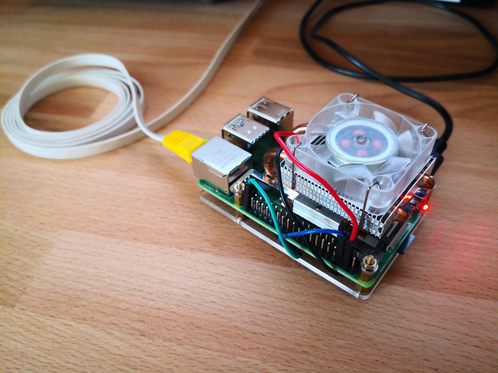

# Raspberry Pi - Fan Control
Simple python daemon to control a fan via GPIO pins and a NPN transistor based on the CPU temperature.

## Hardware Setup
* [Guide I followed](https://fizzy.cc/raspberry-pi-fan/)
* What I used:
    * NPN transistor (PN 2222A 6E) with 220 Ohm resistor at the base
    * Raspberry Pi 4B with 8GB RAM
    * 64-Bit Ubuntu Server 20.04 LTS
    * Cooler used: [GeeekPi Low-Profile Cooler](https://www.amazon.de/GeeekPi-Raspberry-Low-Profile-Horizontal-Heatsink/dp/B07ZV1LLWK/ref=sr_1_19?dchild=1&m=A187Y4UVM6ZA0X&marketplaceID=A1PA6795UKMFR9&qid=1616430764&s=merchant-items&sr=1-19)

## Installation

### Via docker-compose
* Just run `docker-compose up -d`

### Via systemd unit
* Python version used is 3.8.10
* Dependencies can be installed with: `apt install rpi.gpio-common python3-rpi.gpio`
* To setup the daemon I recommend to:
    1. Create a new user: `sudo useradd -m fancontrol`
    1. Lock the user, so one can not login with it: `sudo passwd -l fancontrol`
    1. Allow new user to access gpio pins by adding to a group: `sudo gpasswd -a fancontrol dialout`
    1. Checkout the repository in new users home: `cd /home/fancontrol && sudo -u fancontrol git clone https://github.com/danielgolf/rpi-fan-control.git`
    1. Copy the systemd unit file: `sudo cp /home/fancontrol/rpi-fan-control/rpi_fan_control.service /etc/systemd/system`
    1. Reload systemd: `sudo systemctl daemon-reload`
    1. Activate and run the daemon/service: `sudo systemctl enable --now rpi_fan_control.service`
* The `/home/fancontrol/rpi-fan-control/src/cputemp.py` script can be copied or symlinked to `$HOME/.local/bin/cputemp`

## Configuration
In the main script `rpi_fan_control.py` are four variables for configuration
* `GPIO_PIN`: [Number of GPIO pin](https://cdn.sparkfun.com/assets/learn_tutorials/4/2/4/header_pinout.jpg) to control the fan
* `SLEEP_TIME`: How long to sleep between each cpu temp check
* `CPU_TEMP_FAN_ON`: Temperatur on which the fan is turned on
* `CPU_TEMP_FAN_OFF`: Temperatur on which the fan is turned off

 

---

 

